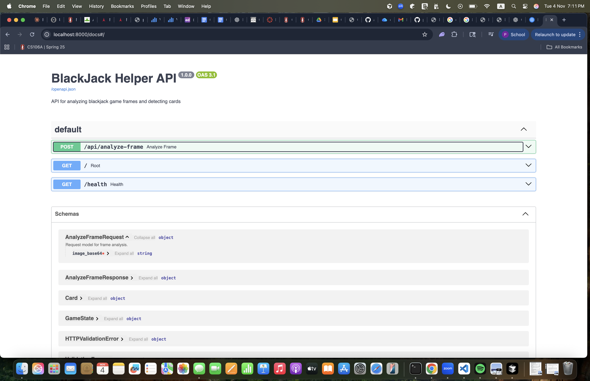
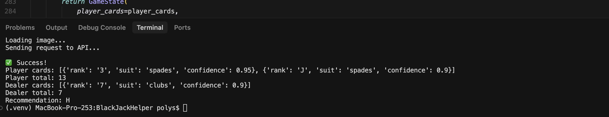
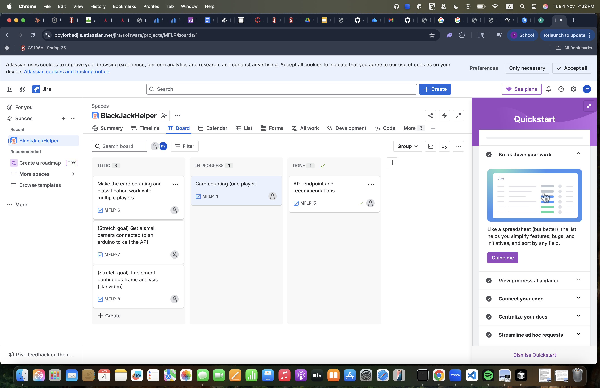

# BlackJackHelper

An API endpoint to identify blackjack hands from video frames using OpenAI Vision.

## Features

- **Card Detection**: Uses GPT-4 Vision API to detect playing cards in video frames
- **Game State Analysis**: Identifies player and dealer cards with confidence scores
- **Hand Value Calculation**: Automatically calculates blackjack hand values
- **Strategy Recommendations**: Provides basic strategy recommendations (hit/stand)
- **RESTful API**: Clean, well-documented API endpoints

## Requirements

- Python 3.8+
- OpenAI API key with GPT-4 Vision access

## Installation

1. Clone the repository:
```bash
git clone https://github.com/polys18/BlackJackHelper.git
cd BlackJackHelper
```

2. Install dependencies:
```bash
pip install -r requirements.txt
```

3. Set up your OpenAI API key:
```bash
export OPENAI_API_KEY='your-api-key-here'
```

## Running the API

Start the server:
```bash
python main.py
```

Or using uvicorn directly:
```bash
.venv/bin/uvicorn main:app --host 0.0.0.0 --port 8000 --reload
```

The API will be available at `http://localhost:8000` on your machine.

### Accessing from Other Devices

The server binds to `0.0.0.0` (all network interfaces), so it's accessible from other devices on your network:

1. Find your computer's IP address:
```bash
# Linux/Mac
hostname -I | awk '{print $1}'

# Or manually check with:
ip addr show  # Linux
ifconfig      # Mac
```

2. Access from other devices using: `http://<YOUR_IP_ADDRESS>:8000`
   - Example: `http://192.168.1.100:8000`

3. Make sure your firewall allows port 8000:
```bash
# Linux (using ufw)
sudo ufw allow 8000

# Check firewall settings on Mac/Windows
```

## API Documentation

### Interactive API Docs

Once the server is running, visit:
- Swagger UI: `http://localhost:8000/docs`
- ReDoc: `http://localhost:8000/redoc`

### Endpoints

#### POST /api/analyze-frame

Analyzes a video frame to detect cards and determine game state.

**Request Body:**
```json
{
  "image_base64": "base64-encoded-image-string"
}
```

**Response:**
```json
{
  "success": true,
  "game_state": {
    "player_cards": [
      {
        "rank": "A",
        "suit": "hearts",
        "confidence": 0.95
      },
      {
        "rank": "K",
        "suit": "spades",
        "confidence": 0.90
      }
    ],
    "dealer_cards": [
      {
        "rank": "7",
        "suit": "diamonds",
        "confidence": 0.85
      }
    ],
    "player_total": 21,
    "dealer_total": 7,
    "recommendation": "stand"
  },
  "error": null
}
```

#### GET /

Returns API information and available endpoints.

#### GET /health

Health check endpoint.

## Usage Example

```python
import requests
import base64

# Read and encode image
with open("blackjack_frame.jpg", "rb") as image_file:
    image_base64 = base64.b64encode(image_file.read()).decode('utf-8')

# Call API
response = requests.post(
    "http://localhost:8000/api/analyze-frame",
    json={"image_base64": image_base64}
)

result = response.json()
if result["success"]:
    game_state = result["game_state"]
    print(f"Player total: {game_state['player_total']}")
    print(f"Recommendation: {game_state['recommendation']}")
```

## Testing

(The tests currently fail because they were written for the first version but I have updated it snce then. I have to update the tests.)

Run the test suite:
```bash
pytest test_main.py -v
```

## Architecture

The API is built with:
- **FastAPI**: Modern, fast web framework for building APIs
- **OpenAI GPT-4 Vision**: For card detection and game analysis
- **Pydantic**: Data validation using Python type annotations
- **Pillow**: Image processing and validation


## Strategy Recommendations

I hardcoded the blackjeck stratergy tables and the cards that are read, are then used to prompt the strategy dictionaries to get the best move.

## Future Enhancements

- Multiple player detection
- Betting recommendations
- Hand history tracking
- Real-time video stream processing


## AI/LLM tool integration

- I used copilot to get the first simple version. This was awesome since it gave a really good sceleton of the project.
- OpenAI for card classification. This is slower than I want, I want to find ways around it so i ccan eventually hit the API with multiple frames (one every second)
- Cursor for writing other code. This is always reliable and a good helper.

## Some screenshots 







### Post Alpha Release:

- Assembled an Arduino Nano with ESP-32 Cam circuit that sends the post requests to the server. I uploaded the Arduino files to the repo. I used chat gpt and oline tutorials a lot for this since I am not very familiar with arduino engineering. 
- Added card counting functionality to keep a running count between frames. 2-6 is +1, 7-9 is +0, 10 J Q K A is -1.
  


